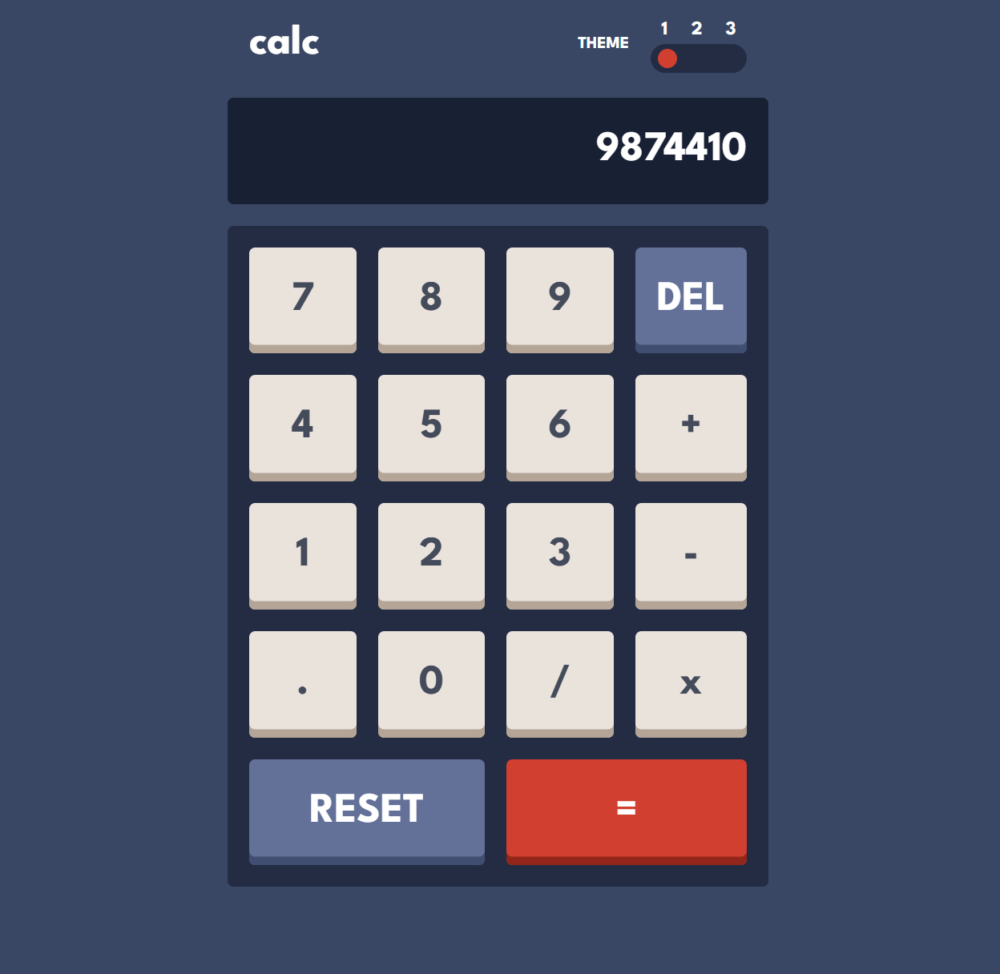

# Responsive Calculator App With Multiple Themes
## Live Site - https://calculator-sriveer.netlify.app/

### Features
- Fully Responsive Web App.
- Can choose one of the three provided themes or create a new one by overriding the _themes.scss file found inside.
- Remembers which chosen theme to show for the next time when this site is opened.
- No Fancy Frameworks,everything written using pure browser API's for easy portability.

Design Inspiration from FrontEndMentor.com

### Preview Image (Example)
